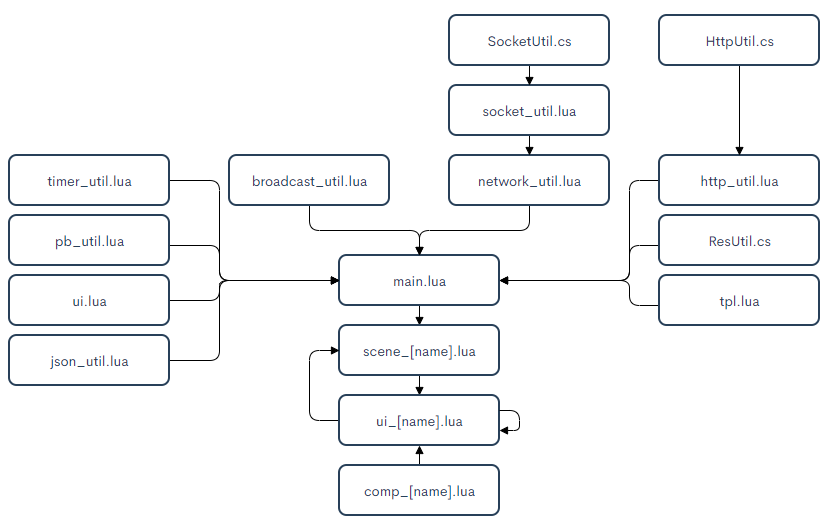

（该框架后续开发手游中，逐步发现一些BUG，等手游项目开发完毕，将开源统一更新并删除这行文字）
# ggb-game-client
该项目是一个基于tolua纯lua开发的U3D客户端框架,对应有一个分布式服务器框架[ggb-game-server](https://github.com/GrayGuardian/ggb-game-server)
## 项目说明
### 功能
1. 纯Lua开发业务逻辑，只要C#底层不改动，直接打AB包导出至服务端即可实现热更新  

2. 可以在线下载、断点续传，大文件资源传输容错率更高  

3. 具备广播、计时器、资源加载等常用游戏管理类  

4. ui管理架构 自动管理层级、委托事件、AB包加载卸载等功能

5. 以C#为底层支持异步的http、socket网络模块

6. 通过protobuf格式传输数据，安全性及效率更高
### 架构图

### 工作流
- 通过`Step`场景里挂载的`Main.cs`作为入口，添加tolua客户端组件`LuaClient.cs`，再通过`LuaClient.cs`加载lua入口文件`main.lua`，开始纯lua调用
- 场景转换将触发`main.lua`内的`OnLevelWasLoaded`函数，通过broadcast广播的形式，在`ui.lua`监听，并创建`scene_[name].lua`实例
- 场景实例中，通过`ui.showUI`的方式再次创建`ui_[name].lua`实例，大部分的游戏逻辑，均写在UI实例中，个别需要绑定在具体物体上的逻辑，可以创建`comp_[name].lua`实例。
## 入门指南
 
这些说明将为您提供项目的副本，并在您的本地机器上运行，用于开发和测试。有关如何在活动系统上部署项目的说明，请参阅部署。
 
### 环境依赖

- Unity 2018.3.10f
 
### 安装
  
1. 通过github下载项目  
`https://github.com/GrayGuardian/ggb-game-client.git`
2. 修改项目配置
  - 修改`Assets/Scripts/Const/GameConst` 的 `URL` `RES_WEB_ROOT` 字段值
 
## 运行测试
 
- 保证配套服务端[ggb-game-server](https://github.com/GrayGuardian/ggb-game-server)已全部启动  

- 选择Step场景，点击Play启动测试

此处仅展示如何快速启动项目测试，具体配置方式请看下方项目导出
 
## 项目导出APK
 
1. 双击 服务端 [ggb-game-server](https://github.com/GrayGuardian/ggb-game-server) 内的 `./tool/protobuf/pb.bat` 导出协议

2. python运行 服务端 [ggb-game-server](https://github.com/GrayGuardian/ggb-game-server) 内的 `./tool/template/build.py` 导出数据模板  

3. 点击 `Lua - Clear warp files` 清空文件，等待按提示重新生成

4. 点击 `Tools - Copy All Default_Res To Resources`，导出默认资源到Resources内，`./Assets/Resources/Default/upres` 中的预制体 `ui_upres` `ui_upres_tip` 需要重新拖拉自身文件夹图片，改变依赖来源。

5. 点击 `Windows - AssetBundle Browser` 导出AB包至 `./AssetBundles` 文件夹内 

6. 修改 `./Assets/Editor/Tool/ResTool.cs` 中 `BuildRes` 函数内的版本信息

7. 点击 `Tools - Build - Build & CopyTo Web` 加密AB包并复制到服务端`web-server`的`Download`文件夹内

8. 暂时将 `./Assets/Resources/AB` 文件夹移出项目,打出apk包后，再移回原位置

打包完毕后的apk 若C#底层代码未修改，则无需重新打包，重复5-7步导出AB包至服务端，重开apk即可进行在线热更新。
 
## 内置
 
* [tolua](https://github.com/topameng/tolua) - tolua框架
* [AssetBundles-Browser](https://github.com/Unity-Technologies/AssetBundles-Browser) - AB包导出插件
